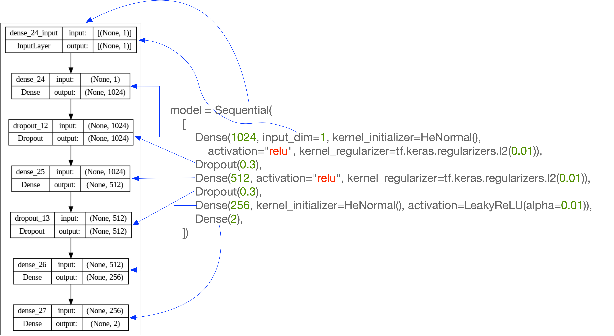

# Drawing an Elephant with Deep Learning

Python notebook that solves [Carlos Ruiz's (Colegio de Matemáticas Bourbaki) challenge.](https://www.linkedin.com/pulse/sobrejuste-de-elefantes-%2525C3%2525A0-la-von-neumann-y-una-beca-carlos-ruiz--jhxgc/)

## Objective.
Using advanced mathematical modeling, construct and analyze a dataset to parameterize the curve from Mayer et al.'s paper ([Drawing an elephant with four complex parameters.](https://pubs.aip.org/aapt/ajp/article-abstract/78/6/648/1042069/Drawing-an-elephant-with-four-complex-parameters))

## Specification

### Dataset
Create a dataset comprising at least 1,000 records.
#### Explanatory Variable
Include one explanatory variable, denoted as t, which ranges from 0 to 2 * pi.
#### Dependent Variables

Incorporate two dependent variables labeled as x and y using the following functions:

* x = -60 *cos(t) - 30 *sin(t) + 8 *sin(2t) - 10 *sin(3t)
* y = -50*sin(t) - 18 *sin(2t) - 12*cos(3t) + 14 *cos(5t)

#### Data Modification
Introduce random noise to the dependent variables x and y. This noise should not follow a predictable pattern and should vary randomly across the dataset.

#### Model Development
Develop a model that fits the dataset and accurately parameterizes the curve defined by the functions for x and y. You may choose from neural networks, kernel functions, Gaussian regression, or any other suitable mathematical model.

## Proposal
The solution uses deep learning. Neural networks are particularly well-suited for capturing complex patterns in data, making them a good choice for this task.

## Model Description
The solution's code defines a neural network model to learn from complex data patterns. This model has a linear stack of layers performing a distinct function in the data processing pipeline.

The first layer in this stack consists of 1024 neurons, each using the Rectified Linear Unit (ReLU) activation function. ReLU is highly efficient for computational purposes and is quite effective in reducing the severity of the vanishing gradient problem, a common challenge in training deep neural networks. However, it's important to note that while ReLU helps mitigate this issue, it still needs to eliminate it, especially in deep networks. Additionally, this layer employs L2 regularization with a factor of 0.01 on its weights. L2 regularization penalizes larger weights, encouraging the model to favor simpler patterns, which helps in preventing overfitting.

Following the first densely connected layer is a dropout layer crucial in enhancing the model's generalization capabilities. This layer randomly sets 30% of the neurons' outputs to zero during each training iteration, effectively reducing the model's reliance on any particular set of neurons. This randomness in deactivating neurons helps prevent overfitting, ensuring the model doesn't become too specialized to the training data.

The network then includes another dense layer with 512 neurons, utilizing ReLU activation and L2 regularization. This layer further aids the model in capturing and interpreting complex relationships within the data. Another dropout layer follows to maintain the regularization strategy, with the same dropout rate of 0.3. This consistent application of dropout helps keep the network robust and less prone to overfitting.

Subsequently, the model features another densely connected layer with 256 neurons. This layer differs in its activation function, employing the LeakyReLU function with an alpha value of 0.01. LeakyReLU is a variant of the standard ReLU that allows a slight, non-zero gradient when the neuron is inactive (for negative input values). This property is crucial in preventing the "dying ReLU" problem, where neurons can cease learning entirely, as it ensures that all neurons in the network remain active and continue to contribute to the learning process.

The final layer of the network is a dense layer with two neurons. Notably, this layer does not specify an activation function, implying a linear activation by default. This design choice aims to solve the regression problem, where the output is a continuous value with two dimensions. The linear nature of this output layer means that the model provides a direct, untransformed representation of the weighted sum of its inputs.

The model's architecture, which combines densely connected layers with ReLU and LeakyReLU activations, dropout, and L2 regularization, is thoughtfully designed for learning intricate data patterns. It solves particular types of continuous output predictions. The model's structure balances the need to learn complex patterns from the data while incorporating mechanisms to prevent overfitting, ensuring robust and generalizable performance.

